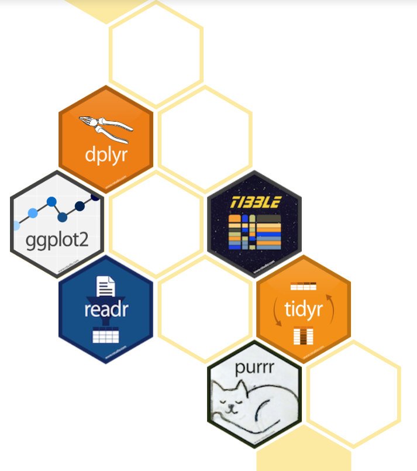

```{r setup, include=FALSE}
options(htmltools.dir.version = FALSE)
```
# www.tidyverse.org

.pull-left[

]

.pull-right[


```{r}

#install.packages("tidyverse")

library(tidyverse)

```
]


---

# Import data {width=50px}


---


# Thanks!

Slides created via the R package [**xaringan**](https://github.com/yihui/xaringan) with the [**R-Ladies theme**](https://github.com/rladies/resources/blob/master/xaringan-slides/how_to_use.md) 

