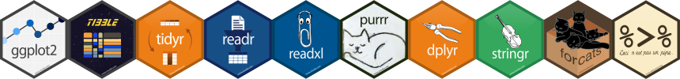
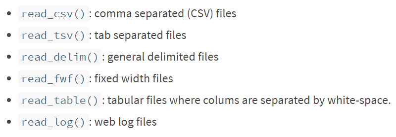
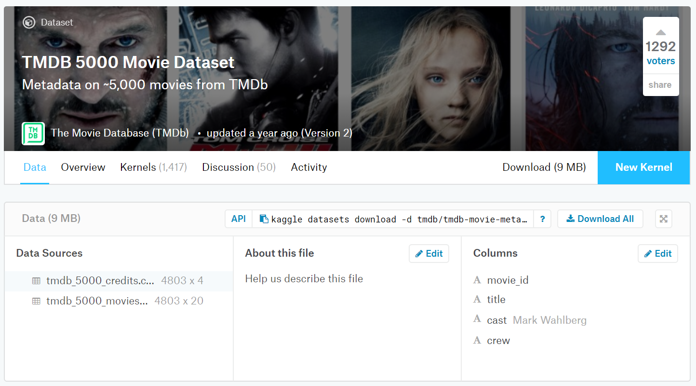

```{r setup, include=FALSE}
options(htmltools.dir.version = FALSE)
#options(crayon.enabled = TRUE)

```


layout: true
  
<div class="my-header"></div>

<div class="my-footer"><span>Cécile SAUDER    
&emsp;&emsp;&emsp;&emsp;&emsp;&emsp;&emsp;&emsp;&emsp;&emsp;&emsp;&emsp;&emsp;
&emsp;&emsp;&emsp;&emsp;&emsp;&emsp;&emsp;&emsp;&emsp;&emsp;&emsp;&emsp;
12/12/2018</span></div> 
---
background-image: url(https://github.com/rstudio/hex-stickers/raw/master/SVG/tidyverse.svg?sanitize=true)
background-size: 500px
background-position: 50% 50%


---
background-image: url(img/tidy_data1.png)
background-size: 800px
background-position: 50% 50%

# Tidy data

---
background-image: url(https://github.com/rstudio/hex-stickers/raw/master/SVG/tidyverse.svg?sanitize=true)
background-size: 100px
background-position: 90% 3%

# [www.tidyverse.org](www.tidyverse.org)


```{r}

#install.packages("tidyverse")

library(tidyverse)

```
  
  
<br /> 
  
```{r, echo=FALSE}


```


---

background-image: url(https://github.com/rstudio/hex-stickers/raw/master/SVG/readr.svg?sanitize=true)
background-size: 100px
background-position: 90% 3%

# Import data 



---

background-image: url(https://github.com/rstudio/hex-stickers/raw/master/SVG/readr.svg?sanitize=true)
background-size: 100px
background-position: 90% 3%

# Import data 




---

background-image: url(https://github.com/rstudio/hex-stickers/raw/master/SVG/readr.svg?sanitize=true)
background-size: 100px
background-position: 90% 3%

# Import data 

```{r, message=FALSE, warning=FALSE}
data_movies <- read_csv("data/tmdb_5000_movies.csv")
data_credits <- read_csv("data/tmdb_5000_credits.csv")

data_movies
```
---

background-image: url(https://github.com/rstudio/hex-stickers/raw/master/SVG/pipe.svg?sanitize=true)
background-size: 100px
background-position: 90% 3%

# Pipe data

- old way : **verb(subject, complements)**
```{r, eval=FALSE}
head(data_movies,3)
```


- pipe way : **subject %>% verb(complements)**
```{r}
data_movies %>% head(3)
```

---

background-image: url(https://github.com/rstudio/hex-stickers/raw/master/SVG/purrr.svg?sanitize=true)
background-size: 100px
background-position: 90% 3%

# Functional programming

```{r}
both <- list("data_movies" = data_movies, "data_credits" = data_credits)

both %>%
  map(names)
```


---

background-image: url(https://github.com/rstudio/hex-stickers/raw/master/SVG/stringr.svg?sanitize=true)
background-size: 100px
background-position: 90% 3%

# String manipulation

```{r}
data_movies <- data_movies %>%
  mutate(Production = case_when(
    str_detect(production_companies,"Disney") ~ "Disney",
    str_detect(production_companies,"Marvel") ~ "Marvel",
    str_detect(production_companies,"DC") ~ "DC",
    TRUE ~ "Other"
  ))
```

--

- Keep just Disney, Marvel and DC movies :

```{r}
data_movies2 <- data_movies %>%
  filter(Production != "Other")
```

---

background-image: url(https://github.com/rstudio/hex-stickers/raw/master/SVG/ggplot2.svg?sanitize=true)
background-size: 100px
background-position: 90% 3%

# Visualize data 

```{r, message=FALSE, fig.width = 12, fig.height=5}

data_movies2 %>%
  ggplot(aes(x=budget, y= vote_average, col = Production, label = original_title)) +
  geom_smooth() +
  facet_wrap(~Production) 
```

---

background-image: url(https://github.com/rstudio/hex-stickers/raw/master/SVG/ggplot2.svg?sanitize=true)
background-size: 100px
background-position: 90% 3%

# Visualize data 

```{r, message=FALSE,fig.width = 12, fig.height=5}
data_movies2 %>%
  ggplot(aes(x=budget, y= vote_average, col = Production, label = original_title)) +
  geom_smooth() +
  facet_wrap(~Production) +
  geom_text(check_overlap = TRUE)
```


---


# Thanks!

- [Cheat sheets](https://www.rstudio.com/resources/cheatsheets/)

Slides created via the R package [**xaringan**](https://github.com/yihui/xaringan) with the [**R-Ladies theme**](https://github.com/rladies/resources/blob/master/xaringan-slides/how_to_use.md) 

